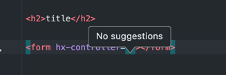

# TagHelperJetBrainsAnnotationsSample

This repository is a sample for [ASP.NET Core Tag Helpers](https://docs.microsoft.com/en-us/aspnet/core/mvc/views/tag-helpers/intro?view=aspnetcore-6.0) together with the [JetBrains.Annotations package](https://www.nuget.org/packages/JetBrains.Annotations/).

JetBrains.Annotations provides code completion for the Tag Helper in [Rider](https://www.jetbrains.com/rider/) and [ReSharper](https://www.jetbrains.com/resharper/) for [TagHelperJetBrainsAnnotationsSample/Views/TagHelperSample/Index.cshtml](TagHelperJetBrainsAnnotationsSample/Views/TagHelperSample/Index.cshtml):

It also recognizes not existing controllers and actions:

## HTMX.TagHelpers and JetBrains.Annotations

However, when using [HTMX.TagHelpers](https://www.nuget.org/packages/Htmx.TagHelpers/), Code Completion inside the Tag Helper tags does not work using Rider or ReSharper (in [TagHelperJetBrainsAnnotationsSample/Views/HtmxSample/Index.cshtml](TagHelperJetBrainsAnnotationsSample/Views/HtmxSample/Index.cshtml).

